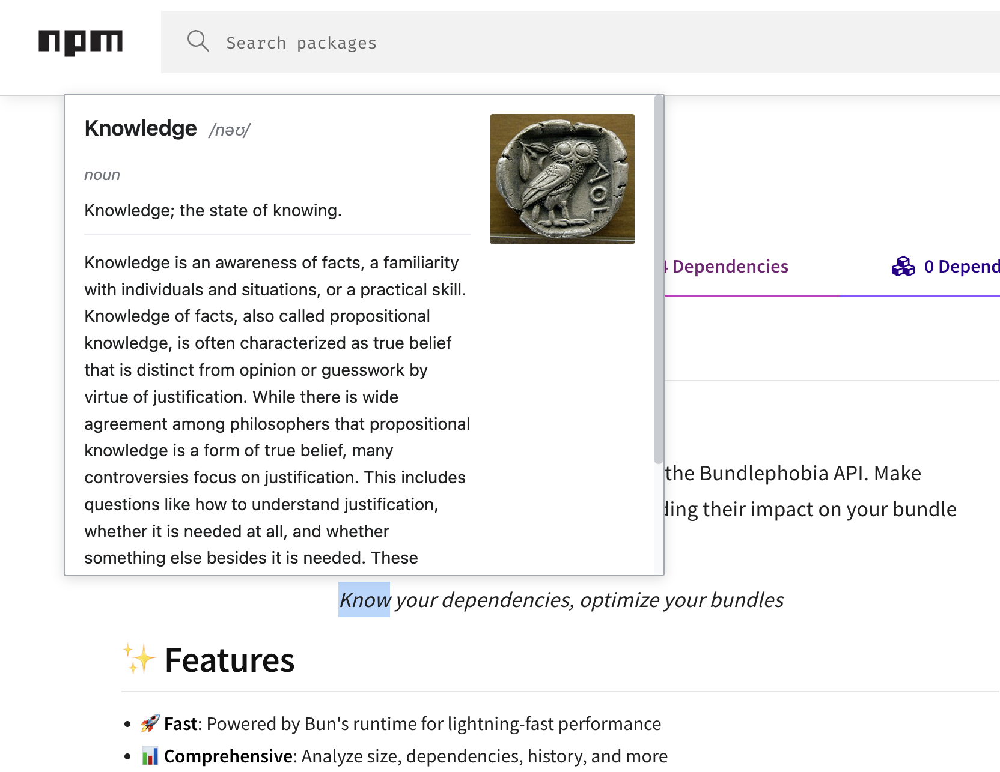

# Melange Ext

**Instant Wikipedia-style dictionary popups for any word you highlight!**



## ✨ Features

- 📖 **Dictionary Definitions** - Get instant word definitions from the Free Dictionary API
- 🌐 **Wikipedia Integration** - See Wikipedia summaries with images for concepts, people, and places
- ⚡ **Lightning Fast** - Appears instantly when you highlight text
- 🎨 **Beautiful Design** - Wikipedia-inspired popup with text on the left and images on the right
- 🌍 **Works Everywhere** - Active on all websites in Chrome

## 🚀 Installation

### From Release (Recommended)
1. Download the latest release ZIP from the [Releases page](../../releases)
2. Unzip the file
3. Open Chrome and go to `chrome://extensions/`
4. Enable **Developer mode** (toggle in top right)
5. Click **Load unpacked**
6. Select the `dist` folder from the unzipped files

### From Source
```bash
# Clone the repository
git clone https://github.com/yourusername/melange.git
cd melange

# Install dependencies
bun install

# Build the extension
bun run build

# Load the dist/ folder in Chrome as an unpacked extension
```

## 📖 Usage

1. **Highlight any word** on any webpage
2. **Popup appears instantly** with:
   - Dictionary definition (part of speech, meaning)
   - Wikipedia summary
   - Related image (if available)
   - Link to full Wikipedia article
3. **Close with ESC** or click outside the popup

## 🛠️ Development

```bash
# Install dependencies
bun install

# Development mode with hot reload
bun run dev

# Production build
bun run build
```

### Project Structure
```
melange/
├── src/
│   ├── content/
│   │   ├── dictionary.ts      # Main dictionary popup logic
│   │   ├── chess_com.tsx       # Chess.com specific script
│   │   └── fb.ts               # Facebook specific script
│   ├── styles/
│   │   └── dictionary.css      # Wikipedia-style popup CSS
│   ├── popup/
│   │   └── index.tsx           # Extension popup UI
│   └── components/
│       └── App.tsx             # React components
├── public/
│   ├── manifest.json           # Extension manifest
│   └── logo.png                # Extension icon
└── dist/                       # Built extension (generated)
```

## 📦 Auto-Release

Every push to `main` automatically creates a new release! The pre-push hook handles version bumping:

```bash
# Just commit and push - version auto-bumps!
git commit -m "feat: add new feature"
git push origin main

# Or manually control the bump type
bun run release        # patch: 1.0.0 → 1.0.1
bun run release minor  # minor: 1.0.0 → 1.1.0
bun run release major  # major: 1.0.0 → 2.0.0
```

GitHub Actions automatically builds and publishes the release with the packaged ZIP file.

## 🔧 Technologies

- **Bun** - Fast JavaScript runtime and bundler
- **TypeScript** - Type-safe development
- **React** - UI components
- **Chrome Extension Manifest V3** - Latest extension format
- **Free Dictionary API** - Word definitions
- **Wikipedia API** - Contextual information and images
- **Husky** - Git hooks for auto-versioning

## 🤝 Contributing

Contributions are welcome! Feel free to open issues or submit pull requests.

## 📝 License

MIT

---

Made with ❤️ using Bun and TypeScript
